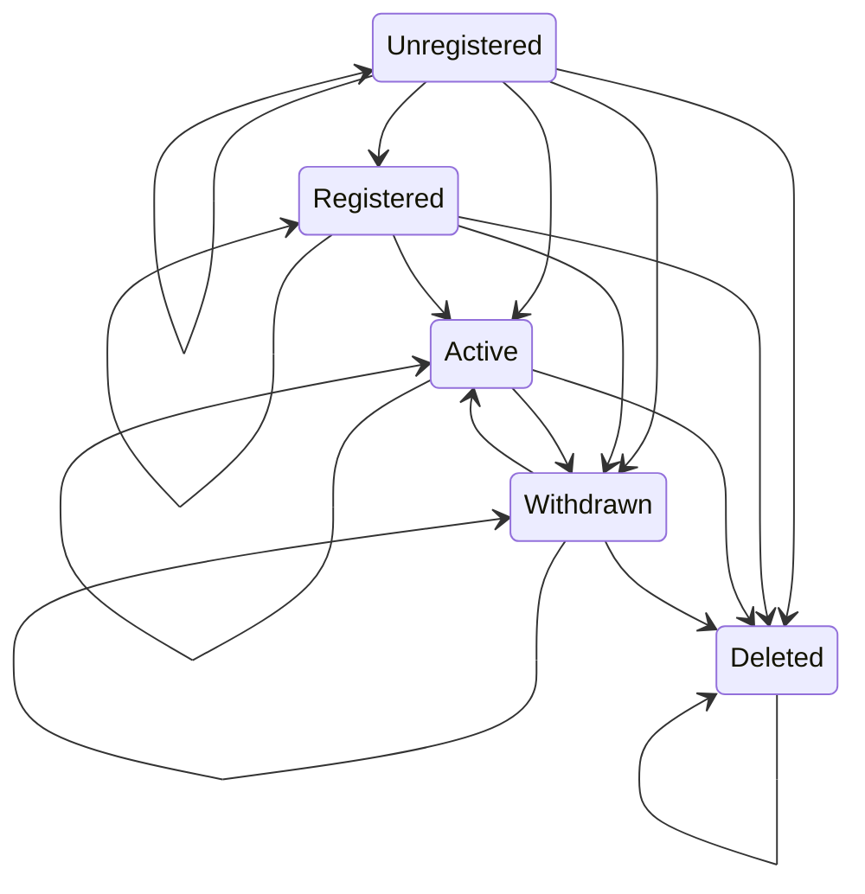
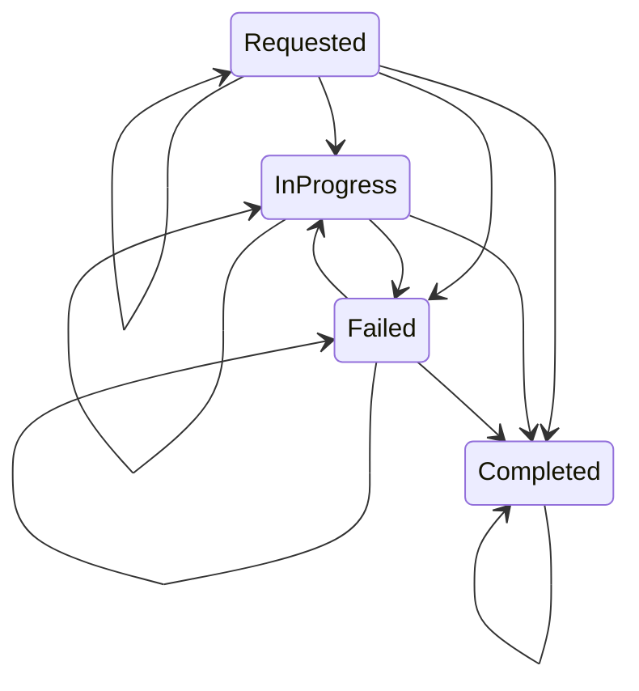

# Distribution Lifecycle

This module provides APIs for implementing lifecycle aware services that react to distribution lifecycle events.

## State Diagrams

The current transition rules are deliberately replay-tolerant:

- Self-transitions are legal so duplicate/replayed events are harmless.
- Forward-reachable catch-up transitions are legal so consumers can converge even if they miss intermediate updates.
- `Deleted` and `Completed` are terminal apart from idempotent self-republish.

### DistributionLifecycleState

### ApplicationState

