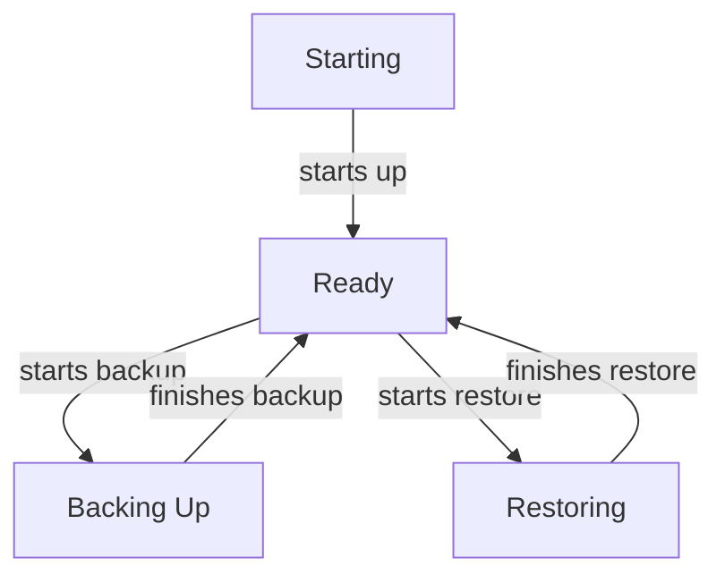

# Backup Tracker

The Backup Tracker API provides a means for synchronising backup operation state between cooperating microservices, this
allows the primary service that orchestrates backup operations to inform secondary services that a backup/restore
operation is happening.  Those secondary services can then take appropriate actions e.g. pausing activity, resetting
their state etc.

This API is provided by the [`backup-tracker`](#dependency) module.

It consists of three main things:

- `BackupTrackerState` - The `enum` of possible states.
- `BackupTransitionListener` - A listener to backup transition events.
- [`BackupTracker`](#backup-tracker) - The actual state tracker API, and concrete implementations thereof.

## `BackupTrackerState`

Backup operation state is tracked via this enum, which in combination with its static `canTransition()` method defines a
state machine for the possible states of backup operations:



Note that we can always transition to the Ready state from any other state, and from Ready we can always transition into
a backup/restore operation.

## `BackupTransitionListener`

A `BackupTransitionListener` is a listener that allows your microservices to listen to the [backup
state](#backuptrackerstate) transitions that are happening, and trigger actions within your application if so desired.

For example a [secondary](#secondary) microservice might wish to pause activity while a backup/restore is in process.

## `BackupTracker`

The `BackupTracker` API is the main API by which applications use this [module](#dependency), it has a pretty straightfoward API:

- `BackupTrackerState getState()` - Retrieves the current [state](#backuptrackerstate)
- `startupComplete()` - Informs the tracker that startup has been completed.
- `startBackup()` - Informs the tracker that a backup is starting.
- `finishBackup()` - Informs the tracker that a backup has finished.
- `startRestore()` - Informs the tracker that a restore is starting.
- `finishRestore()` - Informs the tracker that a restore has finished.
- `close()` - Closes the tracker.

Typically this API will only be called directly by the [primary](#primary) microservice, with [secondary](#secondary)
services having a `BackupTracker` instance available but using [listeners](#backuptransitionlistener) to react to the
automatically synchronised backup state transitions.

A `SimpleBackupTracker` is a pure in-memory implementation of this the API and the underlying [state
machine](#backuptrackerstate).  However microservices will want to use one of the Kafka driven implementations of the
API for production usage.

### Primary

One microservice within an application typically acts the primary which orchestrates backup/restore operations.  This
application should create an instance of the `KafkaPrimaryBackupTracker` e.g.

```java
// Create a KafkaSink
// Note that as we want to guarantee backup transition events are sent ASAP we specify noLinger() and noAsync()
KafkaSink<UUID, BackupTransition> sink
  = KafkaSink.<UUID, BackupTransition>create()
    .bootstrapServers("localhost:9092")
    .topic("backups")
    .keySerializer(UUIDSerializer.class)
    .valueSerializer(BackupTransitionSerializer.class)
    .noLinger()
    .noAsync()
    .build()

// Create a tracker and inform it we've started up
BackupTracker tracker 
  = KafkaPrimaryBackupTracker.create()
    .application("your-app-id")
    .sink(sink)
    .build();
tracker.startupComplete();
```

Where `your-app-id` is a unique identifier for the logical application that this primary microservice forms part of.

Once you have your `BackupTracker` you can then call the relevant [methods](#backuptracker) as backup operations are
orchestrated e.g.

```java
try {
  tracker.startBackup();
  doBackup();
} finally {
  tracker.finishBackup();
}
```

Any [secondary](#secondary) services should have the corresponding `KafkaSecondaryBackupTracker` created and configured
appropriately.

### Secondary

Any secondary microservices within an application, i.e. those that don't orchestrate backup/restore operations, **but**
need to be made aware of them should have a `KafkaSecondaryBackupManager` created e.g.

```java
EventSource<UUID, BackupTransition> source
  = KafkaEventSource.<UUID, BackupTransition>create()
    .bootstrapServers("localhost:9092")
    .topic("backups")
    .consumerGroup("your-consumer-group")
    .readPolicy(KafkaReadPolicies.fromEarliest())
    .commitOnProcessed()
    .keyDeserializer(UUIDDeserializer.class)
    .valueDeserializer(BackupTransitionDeserializer.class)
    .build();

BackupTracker tracker 
  = KafkaSecondaryBackupTracker.builder()
    .application("your-app-id")
    .eventSource(source)
    .listeners(List.of(new YourCustomListener()))
    .build()
```

The secondary backup tracker runs automatically on a background thread listening for transtion events sent by the
corresponding [primary](#primary).  `YourCustomListener`, and any other listeners you might configured for the tracker will be called whenever the primary sends a backup state transition event.

**IMPORTANT** Both the primary and secondary microservices must use the same `application()` value when constructing
their `BackupTracker` instances in order for states to be synchronised and your listeners invoked.  Any backup
transition events for different application IDs are ignored and don't trigger.

This does however mean that all microservices within the Platform can share the same Kafka topic for backup transition
events, as long as each logical application uses a unique application ID.

In order to avoid the secondary microservices having to always re-read past transition events then they commit their
offsets whenever they reach the Ready state.  As noted earlier the [state machine](#backuptrackerstate) defined for
backup operation states allows transitioning to Ready from any other state so the Ready state is always a safe point to
commit.

## Integrating into CLIs

For CLI driven applications the `cli-core` module provides a `BackupTrackerOptions` class that can be added to relevant
command classes e.g.

```java
// NB - If deriving from one of our provided command classes 
//      you may have a suitable Kafka options module already provided
@AirlineModule
private KafkaConfigurationOptions kafka = new KafkaConfigurationOptions();

@AirlineModule
private BackupTrackerOptions backupTrackerOptions = new BackupTrackerOptions();
```

Then in your commands actual logic you can use this to obtain a [primary](#primary) or [secondary](#secondary) instance
as necessary via the `getPrimary()` or `getSecondary()` methods without having to manually construct them yourselves e.g.

```java
BackupTracker tracker
  = this.backupTrackerOptions.getPrimary(this.kafka.bootstrapServers, 
  this.kafka,
  "your-app-id");
```

Or:

```java
BackupTracker tracker 
  = this.backupTrackerOptions.getSecondary(this.kafka.bootstrapServers, 
  this.kafka.getConsumerGroup(), 
  this.kafka,
  "your-app-id", 
  List.of(new YourCustomListener());
```

Once you have those you can utilise the [API](#backuptracker) in your application as needed.

# Dependency

This API is provided by the `backup-tracker` module which can be depended on from Maven like so:

```xml
<dependency>
    <groupId>io.telicent.smart-caches</groupId>
    <artifactId>backup-tracker</artifactId>
    <version>VERSION</version>
</dependency>
```

Where `VERSION` is the desired version, see the top level [README](../../README.md) in this repository for that
information.

Note that some of the other modules, e.g. [CLI Core](../cli/index.md) already depend on this module so an explicit
dependency may be unnecessary.