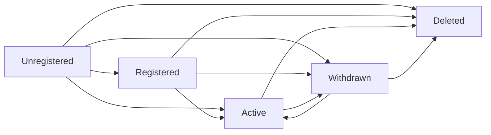
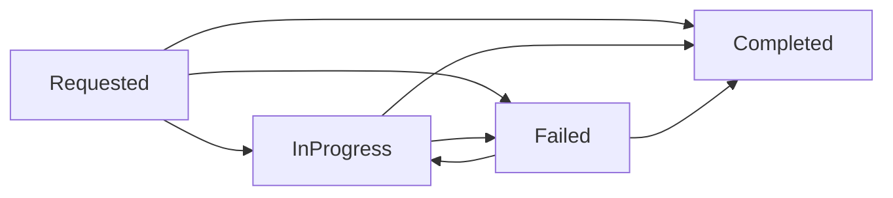

# Distribution Lifecycle

This module provides APIs for implementing distribution lifecycle aware services that react to distribution lifecycle
events.

## Core Concepts

Distributions have a [`DistributionLifecycleState`](#distributionlifecyclestate) that indicates whether they are
acceptable for processing, whether their data should be made visible to end users, and whether their data should be
removed from applications.  See the Javadoc on this `enum` for detailed descriptions of what each lifecycle state means.

State is synchronised across the Core Platform via a shared Kafka topic - by default named `distribution-lifecycle` -
that provides access to several different lifecycle event types which are wrapped within our generic
[`Envelope`](../event-sources/index.md#envelope) type.

When a distribution transitions between states a `LifecycleAction` event is published to the shared Kafka topic
indicating the state transition that occurred (see state diagrams below).  Applications also have `ApplicationState`
associated with each unique `LifecycleAction`.  These lifecycle aware applications publish a series of
`LifecycleAcknowledgement` events to the shared Kafka topic indicating their state with regards to applying each
received lifecycle action (again see state diagrams below).

The state transition rules are deliberately replay-tolerant:

- Self-transitions are legal so duplicate/replayed events are harmless.
- Forward-reachable catch-up transitions are legal so consumers can converge even if they miss intermediate updates.
- `Deleted` and `Completed` are terminal states apart from idempotent self-republish.

### `DistributionLifecycleState`

The following diagram shows the possible `DistributionLifecycleState`'s and the legal transitions between them.  Please
note that self transitions have been omitted from the diagram for clearer rendering.



### `ApplicationState`

The following diagram shows the possible `ApplicationState`'s and the legal transitions between them.  Please note that
self transitions have been omitted from the diagram for clearer rendering.



## State Stores

Lifecycle aware applications need to keep track of the states of different distributions in order to make decisions
about how distributions are processed and made accessible to end users.  The `DistributionLifecycleStateStore` interface
provides a common API for tracking and querying this information.

From an application perspective the state store is typically used in a read-only capacity from application code.  A
[`DistributionLifecycleTracker`](#lifecycle-tracker) is typically created to listen to the lifecycle events and that
handles all the updating of the state store for an application.

The most common methods an application might want to use are as follows:

- `getLifecycleStates()` which returns a `Map<String, DistributionLifecycleState>` providing the current view of all
  known distributions and their lifecycle states.
- `getLifecycleState(String)` which returns the `DistributionLifecycleState` for a specific distribution ID.
- `getApplicationState(UUID, String)` which returns the `ApplicationState` for a specific Lifecycle Event and
  Application.
- `activeEvents()` which returns a `List<LifecycleAction>` representing lifecycle events that are considered active as
  they have not been acknowledged to `Completed`.

### File-backed State Store

Most applications only need to care about the states of distributions, and its own state with regards to processing the
lifecycle events.  Therefore we provide the `AppDistributionLifecycleStoreFile` state store implementation for this, it
is backed by a single state file on disk and it ignores any acknowledgement event that does not pertain to itself.

```java
AppDistributionLifecycleStoreFile store 
  = new AppDistributionLifecycleStoreFile("your-app-id", stateFile);
```

## Lifecycle Tracker

The `DistributionLifecycleTracker` class ties together the listening to events on the shared Kafka topic, the updating
of the applications [state store](#state-stores) and provides a [listener API](#listeners) that allows applications to
inject application specific event handling.

As a complex class this is built using a builder pattern e.g.

```java
DistributionLifecycleTracker tracker
  = DistributionLifecycleTracker.builder()
                                .eventSource(yourEventSource)
                                .stateStore(yourStateStore)
                                .listeners(yourListeners)
                                .listenerThreads(Math.max(yourListeners.size(), 1))
                                .application("your-app-id")
                                .dlq(yourDlq)
                                .build();
```

Obviously the above example omits much of the detail about how the various other components -
[`EventSource`](../event-sources/in-memory.md), [State Store](#state-stores) and DLQ are constructed.

### Listeners

The most important aspect from an application developers perspective is the `listeners()` and the `listenerThreads()`.
The `listeners()` are a list of `DistributionLifecycleListener` implementations which `accept(LifecycleAction)` the
`LifecycleAction`'s arriving on the shared Kafka topic, or which the tracker determines the application has previously
failed to `Complete` acknowledgement of.  Listeners may implement as complex or as simple logic as is necessary for
application purposes, for example here is the trivial `LoggingListener` included in this module:

```java
public class LoggingListener implements DistributionLifecycleListener {
    private static final Logger LOGGER = LoggerFactory.getLogger(LoggingListener.class);

    @Override
    public void accept(LifecycleAction action) {
        LOGGER.info("Distribution {} transitioned from {} to {}", action.getDistributionId(),
                    action.getState().getFrom(), action.getState().getTo());
    }
}
```

In reality applications will mostly need to listen for specific state transitions and act accordingly, for example
here's a listener that triggers for distribution deletion:

```java
@AllArgsConstructor
public class ExampleDeletionListener implements DistributionLifecycleListener {

    @NonNull
    private final DataStore store;

    @Override
    public void accept(LifecycleAction action) {
        if (action.getState().getTo() == DistributionLifecycleState.Deleted) {
            this.store.deleteData(action.getDistributionId());
        }
    }
}
```

Note that since listeners may take a long time to perform whatever processing lifecycle events trigger they are run on
background threads.  The `listenerThreads()` method on the builder configures the number of background threads that are
utilised for running `accept()` methods.  Applications should consider whether any of their listeners may be
particularly long running and configure this appropriately.

### Sending Acknowledgements

In order to help with sending the applications acknowledgements this module also provides an `AcknowledgingListener`
which can be used as a decorator around the applications main [listener](#listeners) and automatically triggers sending
the appropriate `LifecycleAcknowledgement` events as the decorating listener runs.

Again this is quite a complex class so it uses a builder pattern to construct:

```java
AcknowledgingListener listener 
  = AcknowledgingListener.builder()
                        .listener(yourApplicationListener)
                        .sink(kafkaSink)
                        .stateStore(yourStateStore)
                        .application("your-app-id")
                        .version("2.4.8")
                        .build();
```

You register this listener when constructing your [`DistributionLifecycleTracker`](#lifecycle-tracker) and then
acknowledgements are sent automatically for you.

### Tracker Registry

The `DistributionLifecycleTrackerRegistry` is a singleton registry that can be used to store your applications lifecycle
tracker so any part of your application can access it without having to pass the reference throughout your application.

There is a `setInstance(DistributionLifecycleTracker)` method for setting the tracker during your application startup
and then a `getInstance()` method for returning your tracker instance as needed.

> **NB** If you use the [CLI Integration](#cli-integration) then the tracker will be automatically registered for you
> unless the command was started with the `--no-singleton` option.

## CLI Integration

For CLI applications that need to be lifecycle aware there is a `DistributionLifecycleTrackerOptions` class provided in
the [`cli-core`](../cli/index.md) that may be added to relevant command classes e.g.

```java
// NB - If deriving from one of our provided command classes 
//      you may have a suitable Kafka options module already provided
@AirlineModule
private KafkaConfigurationOptions kafka = new KafkaConfigurationOptions();

@AirlineModule
private DistributionLifecycleTrackerOptions distLifecycleOptions = new DistributionLifecycleTrackerOptions();
```

Then in your commands actual logic you can configure a `DistributionLifecycleTracker` like so:

```java
AppDistributionLifecycleStoreFile stateStore 
  = AppDistributionLifecycleStoreFile.builder()
                                     .stateFile(stateFile)
                                     .app("your-app-id")
                                     .build();
DistributionLifecycleTracker tracker 
  = this.distLifecycleOptions
        .create(null, 
                "your-consumer-group", 
                this.kafkaOptions,
                "your-app-id",
                stateStore, 
                1,
                List.of(this.distLifecycleOptions
                            .createAckListener(null,
                                              this.kafkaOptions,
                                              "your-app-id",
                                              "2.4.8",
                                              stateStore,
                                              yourListener)));
```

Note that the provided consumer group, `your-consumer-group` in the above example, **MUST** be a unique consumer group
for your application.  If your application may have multiple replicas then this value **SHOULD** include some
deterministic per-replica component to ensure that each replica can separately listen, and react, to lifecycle events as
needed.

The options class provides two helper methods for application developers:

1. `createAckListener()` for creating our aforementioned [`AcknowledgingListener`](#sending-acknowledgements) as a
wrapper around your actual listener.
2. `create()` for creating the actual lifecycle tracker.

As noted earlier this will be automatically registered with the [registry](#tracker-registry) so your application
doesn't need to actively pass references to the tracker around, instead it can access it via the registry as needed.

## Dependency

These APIs are provided by the `distribution-lifecycle` module which can be depenended upon like so:

```xml
<dependency>
    <groupId>io.telicent.smart-caches</groupId>
    <artifactId>distribution-lifecycle</artifactId>
    <version>VERSION</version>
</dependency>
```

Where `VERSION` is the desired version, see the top level [README](../../README.md) in this repository for that
information.