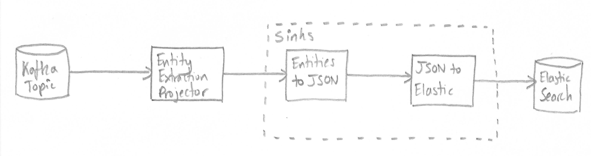

# Smart Caches Core Overview

These Core Libraries are intended for rapidly building Smart Cache implementations in Java. It provides a lightweight
functional API for defining data processing pipelines as well as more admin/operations oriented APIs for invoking and
running Smart Cache pipelines.

This landing page provides an overview of the Core Concepts and Components within these libraries and provides links to
more detailed documentation on each area. If you'd like to understand more about the [Design](design.md) of these
libraries that is detailed in a separate document.

# Core Concepts

These libraries are built around a number of core concepts which are used together to build up data processing
pipelines. We provide brief overviews of these concepts here with links to more detailed documentation, where you will
also find documentation for the concrete implementations of these and example usage.

## Event Source

An `EventSource` provides access to a source of `Event` and is strongly typed. So for example an `EventSource<String,
Graph>` provides a source of events where each event has a `String` key and an RDF `Graph` value.

You can check whether events are available, poll for the next available event, and close the event source when finished
with it.

See the [Event Source](event-sources/index.md) documentation for more details.

## Observability: Component Event Sources and Metrics

Extending on the concept of event sourcing above, `ComponentEventSource` allows any application component to be a source 
of `ComponentEvent` and is strongly typed. The first application of this is for components to emit metric events. These
are events with one or more associated metrics emanating from their processing activities.

So for example, a search API may implement `ComponentEventSource<SearchEvent>`, signifying it produces events related to
search. Such events might contain information about the term searched, the identity of the person or principle performing
the search and the time taken for ElasticSearch to carry out the search (i.e. a `DurationMetric`).

Refer to [Observability](observability/index.md) for further information.

## Sinks

A `Sink` is a functional interface to which items can be sent for processing. This is intended for defining simple
processing pipelines that implement data processing or transformation. 

By simple pipelines we mean those that represent linear, non-branching sequences of processing steps. See the 
[Related Work](design#related-work) section of the [Design](design.md) overview for discussion of alternative processing
frameworks.

Like an Event Source this is a strongly typed interface, so you might have a `Sink<Graph>` for a sink that takes in RDF
Graphs.

See the [`Sink`](sinks/index.md) documentation for more details.

## Entities

An `Entity` is a view over data that is entity-centric. An individual event from an `EventSource` may batch up a bunch
of data about several entities, e.g. people, places, things, whereas a data processing pipeline may only be concerned
with a subset of those entities. The `Entity` class provides a minimal representation of an entity, it has a mandatory
URI that identifies the entity, then may have a set of namespace prefixes and/or some `EntityData`.

## Projectors

A `Projector` takes in an input and produces zero or more outputs to a provided `Sink`.
Again this is strongly typed, so you might have a `Projector<Graph, Entity>` that projects from RDF Graphs to Entities.

A [`ProjectorDriver`](projection/driver.md) automates the connection of the various core concepts into a runnable
application. It takes in an `EventSource`, a `Projector` and a `Sink` and automates the polling of events from the event
source and passing those through the projector and onto the `Sink`. It also takes various additional parameters to
control various aspects of this behaviour, see the [Projection](projection/index.md) documentation for more details.

# Other Components

There are also some other components included in this repository, while these are more focused to specific classes of
applications they are still sufficiently general to be included here.

## Metrics and Observability

The `observability-core` module provides some helper utilities around integrating Open Telemetry based metrics into
applications built with these libraries.  Various classes throughout the other libraries use the Open Telemetry API to
declare and track various metrics.  Please see the [Observability](observability/index.md) documentation for details of
how to make these metrics actually accessible, and to add additional metrics to your applications.

## Live Reporter

The `live-reporter` module provides the `LiveReporter` that enables Java based applications to report their status
heartbeats to Telicent Live, our platforms monitoring dashboard.  Please see the [Live Reporter](live-reporter/index.md)
documentation for more details on this module.

## Configuration API

The `configurator` module provides the `Configurator` API that is a lightweight abstraction for obtaining application
configuration.  In particular this makes it easy to inject configuration in multiple ways which is especially useful for
unit and integration tests.

Please see [Configurator](configurator/index.md) documentation for more details.

## CLI API

The CLI provides an API for creating CLI entry points to data processing pipelines. It defines a common
`SmartCacheCommand` from which CLI commands can be derived and various abstract implementations of this class that
provide prefabricated entry points for common pipelines.

Please see [CLI](cli/index.md) documentation for more details.

## JAX-RS Base Server

The JAX-RS Base Server provides a basic starting point for new JAX-RS based server applications including lots of common
machinery around error handling, authentication and configuration.

Please see [JAX-RS Base Server](jaxrs-base-server/index.md) documentation for more details.

# Building Pipelines

Using the various concepts provided by these libraries we can build new data processing pipelines relatively easily
since many of the components we need are reusable and configurable.  For example, you might conceive of a pipeline 
like the following:

The above example is implemented in the [ElasticSearch Smart Cache][1] repository where everything except the final
*JSON to Elastic* piece is provided from this repository.

**Note** that the actual pipeline as implemented has additional sinks in it versus the above rough design sketch. We use
a [Throughput Sink](sinks/throughput.md) for logging throughput metrics, a [Filter Sink](sinks/filter.md) for filtering
out irrelevant entities, and a [Duplicate Suppression](sinks/duplicate-suppression.md) sink to avoid repeatedly indexing
identical entity representations.

The entire pipeline ends up being:

1. Event Source
2. Entity Centric Projector
3. Throughput Metric Reporting
4. Filter Irrelevant Entities
5. Convert Entities into JSON Document Structure
6. Duplicate Document Suppression
7. Bulk Indexing to ElasticSearch

All of which is automated via a [`ProjectorDriver`](projection/driver.md).

Every piece of the pipeline uses functionality, or interfaces, from these Core Libraries to build the overall pipeline.
You can find more detailed documentation on this pipeline in [that repository][1].

[1]: https://github.com/Telicent-io/smart-cache-knowledge-search
