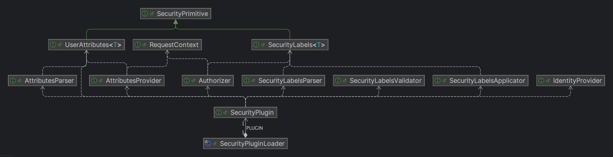

# Security Plugins

The `SecurityPlugin` interface provides an abstraction around the Telicent Core Platform's label based security model
allowing applications to enforce the model without needing any direct knowledge of how the labels are interpreted and
enforced.

## Change History

| Version | Date      | Notes                                                                                                                                                                                                     |
|---------|-----------|-----------------------------------------------------------------------------------------------------------------------------------------------------------------------------------------------------------|
| 1       | Nov 2024  | Initial Draft                                                                                                                                                                                             |
| 2       | Dec 2024  | Added [`RequestContext`](#requestcontext) API, expanded [`Authorizer`](#authorizer) API to allow for multiple kinds of access decision.                                                                                       |
| 3       | Feb 2025  | Reverted use of `Entitlements` terminology in favour of User Attributes. Clarifications around ability of [`Authorizer`](#decision-vs-enforcement) to act as either a Policy Enforcement Point and/or a Policy Decision Point. |
| 4       | June 2025 | Renamed `canUse()` to `canMakeRequest()` for clarity, minor editorial clean up .                                                                                                                          |

## Problem Statement and Context

The current security model within the Telicent Core Platform is hardcoded to [RDF-ABAC][RdfAbac] which is a RDF centric
implementation of Attribute Based Access Control ([ABAC][NistAbac]).

> An access control approach in which access is mediated based on attributes associated with subjects (requesters) and
> the objects to be accessed. Each object and subject has a set of associated attributes, such as location, time of
> creation, access rights, etc. Access to an object is authorized or denied depending upon whether the required (e.g.,
> policy-defined) correlation can be made between the attributes of that object and of the requesting subject.

In our implementation of this model, data has a `Security-Label` applied to it which is an RDF-ABAC expression providing
basic logical policy for who can access data.  For example the label expression `clearance=S && (nationality=UK ||
nationality=US)` expresses that a user must hold `S` level clearance and be of either `UK` or `US` nationality.

While quite complex logical policy can be built up in these label expressions they are fundamentally fixed expressions
and cannot express more nuanced security policies, for example only permitting users to access data during normal
working hours. As the label expression encodes the policy they can also get very large and complex if we wish to express
more complex policies, in some cases we have seen the labels be much larger than the data items themselves.

Also in this model the supplier of user attributes, which are used to determine whether a user satisfies a label
expression, and thus can see data is only [Telicent Access][TcAccess].  This provides for a limited range of user
attributes without possibility of extension.

Customers want to express more complex and flexible security policies that take into account a wider array of user
attributes such as location (both physical and network), working hours, job assignments/roles etc.  In order to do this
we need to be able to support more flexible security approaches like Policy Based Access Control ([PBAC][NistPbac]): 

> A strategy for managing user access to one or more systems, where the business roles of users is combined with
> policies to determine what access privileges users of each role should have. Theoretical privileges are compared to
> actual privileges, and differences are automatically applied. For example, a role may be defined for a manager.
> Specific types of accounts on the single sign-on server, Web server, and database management system may be attached to
> this role. Appropriate users are then attached to this role.

In order to support other security models like PBAC we need to move away from our hardcoded dependency on RDF-ABAC by
introducing a new abstraction layer for security.

A closely related issue is that currently security labels are only used for deciding whether users are permitted access
to read data.  Going forward we need to offer more nuance in the authorisation decisions we can make, including whether
users can write data, and whether they can access specific API resources.  Currently API resource access is managed
completely separately from our main security model so part of the goal of this design is to unify authorisation
decisions within a single framework.

## Requirements

- Customers **MUST** be able to label data with security labels that support their desired security model
- Customers **MUST** be able to enforce more flexible security models than ABAC
- The Platform **MUST** be able to apply and enforce security labels coherently across the platform.
- The Platform **MUST** allow for additional kinds of authorisation decision beyond what is currently possible:
    - Whether a user can write data
    - Whether a user can access API resources

## Design

In this section we first outline the design motivation behind the interfaces that are defined, see
[Interfaces](#interfaces) for outlines of the various interfaces and their usages.  As with everything else in our Core
Libraries this follows our general [Design Ethos](../design.md#design-ethos).

The following sequence diagrams aims to show the general flow of data and labels within the platform, as it pertains to
this Security Plugin API.  Firstly we look at how labels flow into the platform, and how they are processed and applied
by applications:


This flow is effectively unchanged from how the platform currently works, the main difference being that applications
treat security labels opaquely, rather than interpreting them as RDF-ABAC expressions.  Note that per [Label
Storage](#label-storage) some existing applications may need to change how they store labels alongside data to account
for this.

In this second diagram we show the flow of a request for labelled data being processed by an application within the
platform:


Again this flow is broadly similar to what our applications do today, the practical changes are the use of the new API
as opposed to RDF-ABAC APIs, and the additional API authorisation check which is currently handled prior to requests
reaching an application.  For this second flow you can see it in code terms in the later [Example
Usage](#example-usage).

### Label Format & Syntax

As background, remember that all events flowing through Kafka within the Core Platform are expected to have a
`Security-Label` header present that indicates the labels that apply to the data.  Additionally, RDF format events on
the `knowledge` topic *MAY* optionally include a labels graph that provides fine grained labels for individual triple(s)
within the event.  Currently these labels are expressed as [RDF-ABAC Attribute Expressions][RdfAbac] which are strings
declaring an Attribute Based Access Control (ABAC) policy in the form of attribute expressions.

In some deployments customers already provide labels in alternative formats within other headers which data pipelines
are required to translate into RDF-ABAC Attribute Expressions in order to apply an appropriate `Security-Label` header.
This can lead to data flowing through the platform with multiple, potentially conflicting, security headers if the
translation is not handled correctly.

As part of evolving the platform towards a more flexible Policy Based Access Control (PBAC) model the new plugin APIs
introduced from `0.30.0` onwards instead treat the `Security-Label` as opaque byte sequences.  These byte sequences have
an optional 4 byte schema prefix to allow plugins to detect whether they support a particular label schema and reject
labels they don't support.  This also allows for versioning of label schemas if the data format of a schema doesn't
directly support versioning in its encoding.

**NB** This also potentially provides the capability for future plugins to provide support for multiple label schemas
coexisting within the platform.  However, it is not our intention to support this mode of operation anytime in the
forseeable future.

When present the schema prefix consists of the 4 byte sequence `0x1e ? ? 0x1e`, where `0x1e` is the record separator
byte, and the 2nd and 3rd bytes are an encoded `short` denoting a schema identifier. This allows for up to ~65k unique
label schemas, which even allowing for versioning of schemas should be more than we ever expect to use.  The
`SecurityPlugin` interface offers static `encodeSchemaPrefix()` and `decodeSchemaPrefix()` methods for writing and
reading this prefix.  Note that for `decodeSchemaPrefix()` the return type is the reference `Short` type allowing `null`
to be returned when the prefix is not present.

Making this schema prefix optional is an intentional choice, with the schema identifier assumed to be `0` in this case.
This allows us to make this security API evolution backwards compatible with existing usage of RDF-ABAC labels within
our deployments as any label we see without the prefix byte sequence can be assumed to be an RDF-ABAC label.

Within a label schema the remainder of the byte sequence for a label can be used to encode labels in whatever format an
implementation sees fit.  So taking RDF-ABAC, which will become our default plugin, as an example then it treats the
byte sequence as a UTF-8 encoded string.  However plugin implementations are free to use whatever label format and/or
encoding scheme they see fit since the API will treat the byte sequence opaquely.

A couple of possible labelling schemas within this model (assuming a suitable plugin implementation) are as follows:

- Existing customer deployments that use a JSON based header could supply the JSON value directly
- A complex labelling approach might choose to encode the labels in a binary format, e.g. [Protobuf][Protobuf], [Apache
Avro][Avro], [Apache Thrift][Thrift] etc.

The `SecurityLabels<T>` interface treats labels in abstract terms, allowing API users to be treat the labels in entirely
abstract terms, while a plugin can internally decode the encoded byte sequence into whatever data structures it needs to
operate over.  A plugins `SecurityLabelsParser` converts from the opaque byte sequences into a plugins specific
`SecurityLabels` implementation, note that there is no corresponding encoding interface needed as access to the opaque
byte sequence is always provided by the `SecurityLabels` interface so applications that need to store labels for later
evaluation can simply store the opaque byte sequence directly.

#### Notes on encoding fine-grained labels

This change does not preclude the existing usage of fine-grained label graphs, but again some evolution is needed.  A
labels graph means we are using a concrete RDF syntax, e.g. Turtle, so we are constrained to encoding labels as strings
in those syntaxes.  Therefore, in order to support arbitrary label schemas as described above the labels graph **MUST**
encode labels as [`xsd:base64Binary`][XsdBase64] typed literals e.g.

```ttl
@prefix xsd:     <http://www.w3.org/2001/XMLSchema#> .
@prefix foaf:    <http://xmlns.com/foaf/0.1/> .
@prefix authz:   <http://telicent.io/security#> .
@prefix data:    <http://data.gov.uk/testdata#> .

[ authz:pattern 'data:Fred foaf:age 34' ; authz:label "Z2Rwcg=="^^xsd:base64Binary ] .
```

This allows us to encode arbitrary label byte sequences in a string based syntax using the standard RDF datatype
mechanics.

Again for backwards compatibility existing RDF-ABAC labels graphs, where labels are given as plain string literals, are
still honoured, so the following existing valid labels graph would continue to be considered equivalent:

```ttl
@prefix xsd:     <http://www.w3.org/2001/XMLSchema#> .
@prefix foaf:    <http://xmlns.com/foaf/0.1/> .
@prefix authz:   <http://telicent.io/security#> .
@prefix data:    <http://data.gov.uk/testdata#> .

[ authz:pattern 'data:Fred foaf:age 34' ; authz:label "gdpr" ] .
```

### User Attributes

Our existing security model closely couples RDF-ABAC labels with the User Attributes returned by the [Telicent
Access][TcAccess] service where user attributes are returned in a specific JSON object schema.  Applications are also
strongly coupled to Access in that they need to be directly aware of configuring themselves to talk to it in order to
retrieve user attributes to provide label enforcement decisions.

Therefore as part of this new API we adopt a similar approach to [Labels](#label-format--syntax) in that we move to
treat user attributes as opaque byte sequences with responsibility for retrieving and interpreting user attributes
left to plugins via their `AttributesProvider` and `AttributesParser` implementations.  This means that the burden
of configuring any necessary supporting services, e.g. connectivity to [Telicent Access][TcAccess], becomes an internal
implementation detail of a plugin, rather than an application concern. 

User attributes use the same optional schema prefix as part of the byte sequences to allow plugins to distinguish
between different attribute schemas they may support, and this allows for future plugins to potentially combine
multiple attribute providers.

As with labels the `UserAttributes<T>` interface treats user attributes in abstract terms from an application perspective
while allowing a plugin implementation to decode the user attributes into whatever data structure(s) are appropriate. A
plugins implementation of the `AttributesParser` interface can supply whatever decoding logic it needs for its
implementation.

User attributes may include a variety of user attributes, including but not limited to the following:

- User specific attributes, e.g. name, job role, clearance, nationality etc.
- Request contextual attributes, e.g. physical location, device, connection

Part of this Security Plugin model is that a customers chosen plugin can provide data from as many attribute sources,
and of many types, as is needed to enforce a given security labelling schema.

### Data Access Enforcement

Data Access Enforcement is done by combining the users retrieved [User Attributes](#user-attributes) with the
[Labels](#label-format--syntax) present on the data.  This is done by first preparing an `Authorizer` via the
`prepareAuthorizer()` method passing in the user attributes.  `Authorizer` instances are intended to be scoped to the
lifetime of a single user request so they may cache any access decisions if they encounter the same labels repeatedly.

Once an application has an `Authorizer` it calls one of the `canRead()`/`canWrite()`/`canMakeRequest()` methods passing in
the labels for the data it needs an access decision for and any additional required parameters.  This returns either
`true` for accessible, or `false` for forbidden.  In the event of any problem/ambiguity in computing access decisions
plugins **MUST** fail-safe by defaulting to returning `false` if they can't make an access decision.

Note that since the plugin has full control over access decisions it can use as simple, or as complex, logic as it sees
fit to implement it's security model.  For example the labels might not directly encode the access requirements for
data, but rather provide reference to one/more externally managed policies that apply, and the `Authorizer`
implementation would understand how to resolve and evaluate those externally managed policies.  Thus, a key feature of
this proposed API, is the ability for implementors to provide indirection between data labels and the access polices
that apply, as opposed to our current RDF-ABAC model where the labels directly encode the access policy.  See [Decision
vs Enforcement](#decision-vs-enforcement) discussion later for more detail on this aspect of the API.

You can see the complete lifecycle outlined later in [Example Usage](#example-usage).

### Plugin Loading

Plugins are loaded by applications by calling `SecurityPluginLoader.load()` which uses the JVM `ServiceLoader` to locate
registered plugins.  The loaded plugin is cached for the lifetime of the JVM so subsequent calls just return the
previously loaded instance.

The expectation is that there is `1`, and **ONLY** `1` plugin registered in this way.  If no plugin is registered, more
than 1 plugin is registered, or loading the registered plugin throws an error, then the application defaults to a
fail-safe mode and instead loads the unregistered `FailSafePlugin`. In fail-safe mode the application treats all labels
and user attributes as invalid and defaults all access decisions to forbidden.  This will be clearly and explicitly
noted in the logs, and an explicit `Error` is thrown upon the first, and all subsequent load attempts to make it clear
to the application that it has been misconfigured.

Note that depending on how an application is implemented the `SecurityPluginLoader` throwing this error *MAY* cause
the application to enter a crash-restart loop until the plugin misconfiguration is resolved.  However, since we cannot
guarantee this case, e.g. an application developer might catch and ignore the error, we define the above fail-safe
behaviour as a secure fallback.

Please see [Implementation Notes](#separating-logic-and-registration) for the practical implementation aspects of plugin
registration that implementors should be aware of.

#### Plugin Loading in Deployments

Plugins will be loaded into applications by mounting them into the containers at a well known path -
`/opt/telicent/security/plugins/` - that all applications **MUST** add to their classpath if it exists.  This path
**MUST** be added to the end of the classpath so that the JVM will favour loading the applications dependencies over the
plugins dependencies **SHOULD** there be overlap between those. Plugins **SHOULD** also be mounted as read-only files to
minimize the possibility of any tampering.

The proposed plugin mounting mechanism is that Telicent, or the customer, builds a container image that contains their
plugin (and its dependencies) and uses a K8S init container to copy these into an `emptyDir` volume that will be shared
with the main application container.  This init container can be injected into all relevant application manifests by way
of common `kustomize` patches.

Telicent will provide a default patch as part of our base manifests that injects our [Default Plugin](#default-plugin).

## Interfaces

In this section we outline the different interfaces that make up the Security Plugin API in more detail.  Note that we
have intentionally kept each interface focused on a very specific role between the API.  This is to make it easy for
Telicent, customers and 3rd parties to implement new plugins by composing behaviour from existing plugins if they see
fit.

For example using this API we could build a plugin that continues to use RDF-ABAC labels but replaces [Telicent
Access][TcAccess] with a different user attributes service.

The following class diagram summarises the relationships between the various interfaces:



### `SecurityLabels<?>`

`SecurityLabels` is a generic type that holds security labels, it holds the `encoded()` byte sequence as a `byte[]`, a
`schema()` identifier as a `short`, and its `decodedLabels()` method provides access to the concrete labels type a
security plugin uses for its implementation.  It also has a `toDebugString()` method that allows implementations to
provide a human-readable representation of the labels for debugging purposes, note that this differs from the standard
`toString()` method in that it may want to translate from whatever encoding schema has been used to something a
developer/system operator can understand, whereas `toString()` should just provide a quick view of the labels e.g.
schema and encoded data length.

The `AbstractSecurityPrimitive` class provides a basic implementation of most of the interface allowing implementations
to focus on their implementation detail.

### `UserAttributes<?>`

`UserAttributes` is a generic type that holds user attributes, it holds the `encoded()` byte sequence as a `byte[]`, a
`schema()` identifier as a `short`, and its `decodedAttributes()` method provides access to the concrete user attributes
type a security plugin uses for its implementation.  Again the `AbstractSecurityPrimitive` class provides a basic
implementation of most of the interface.

### `RequestContext`

A `RequestContext` holds details of the context of a particular request arriving at an application/service.  It includes
the users verified JWT, their username as returned by the [`IdentityProvider`](#identityprovider), and access to other
request context such as HTTP Method, URI, Path and Headers (assuming a HTTP request).

For requests that arrive over other communication protocols, e.g. gRPC, then applications will still need to populate
this structure accordingly but may not necessarily be able to supply values for all the methods.

A `MinimalRequestContext` implementation is provided in the `security-core` module that holds only the verified JWT and
username.  In the `jaxrs-base-server` module, which most Telicent application API servers are built upon, there is a
`JaxRsRequestContext` that provides a full implementation for JAX-RS applications, this is automatically injected into
the request attributes of authenticated requests so application filters and/or resources can access it as needed.

### `SecurityPlugin`

`SecurityPlugin` is the top level entrypoint API by which applications interact with the Security Plugin API.  Primarily
this is just a place for applications to obtain instances of the other interfaces they need to carry out data processing
and access control tasks.

An implementation should generally make the instances of the other interfaces singletons where the API allows it e.g.
there should be a single shared `SecurityLabelsParser`.  However implementations **MUST** be aware that they will be
used in multi-threaded environments thus any singleton instance they return **MUST** be thread-safe.

Note that some of the interfaces a plugin provides instances of have specific lifecycles associated with them, e.g.
`Authorizer`, so for those an implementation **MUST** ensure they respect the defined lifecycle of that interface.
These interfaces are clearly marked by having them extend `AutoCloseable` so that the Java compiler will issue warnings
if application developers are not actively `close()`'ing the obtained instances, or using them in a `try-with-resources`
block to implicitly `close()` them as shown in the [Example Usage](#example-usage).

### `IdentityProvider`

The Core Platform relies upon Open ID Connect (OIDC) as the authentication mechanism and uses Bearer tokens in the form
of cryptographically signed JSON Web Tokens (JWTs).  Depending on how a given deployment is configured there *MAY* be
multiple underlying identity providers, but by design individual applications don't need to be aware of these, they
merely need to be able to cryptographically verify the presented tokens using the public keys of the identity providers.

However, in practical terms most applications deal with users, rather than tokens, when making access decisions.  Thus a
key part of a plugin is the `IdentityProvider`.  This interface translates from the authenticated users JWT into a user
identifier that the application can use, typically this is some form of username/email address.  However, depending on
the security plugin and/or deployment this may need to be a more opaque identifier since email addresses may be reused
across multiple identity providers e.g. some combination of the `iss` and `sub` claims from the JWT.

For most plugins we don't expect the mapping of JWT to user identity to vary so we provide a generic
`DefaultIdentityProvider` that we expect most plugins will reuse.  This maps the user identity by looking for claims in
the JWT payload in the following (configurable) order of preference:

- `email`
- `username`
- `sub`

With the first two being optionally configurable via the `jwt.username.claims` configuration parameter accessed via our
[`Configurator`](../configurator/index.md) API.  So customers that wished to force the `email` claim to be used could
set that configuration to just be `email`.

Note that `sub` is always used as a fail-safe fallback since all JWT issuers **SHOULD** at least provide a `sub` claim.
For cases where no usable identity claim is provided requests are generally rejected at the API layer prior to the point
where the `IdentityProvider` API would be invoked.

The `IdentityProvider` to use is obtained via the `SecurityPlugin.identityProvider()` method.

### `AttributesProvider`

The `AttributesProvider` takes in the [`RequestContext`](#requestcontext) and uses the information in it to
obtain/calculate the user attributes information it needs to make access decisions.  In practical terms this might mean
communicating with some external user attributes service (e.g. [Access][TcAccess]), accessing some embedded
authorization database, decoding additional claims from the presented JWT, inspecting the request context etc.  These
underlying services effectively act as Policy Control Points (PCPs) within the platform since they may choose to provide
different attributes to users depending on the request context, and they may return references to applicable policies in
the user attributes for the [`Authorizer`](#authorizer) to apply later.

This interfaces single `attributesForUser(RequestContext)` method returns the generic `UserAttributes<?>` type allowing
the plugin to obtain and supply user attributes however it sees fit.  The `AttributesProvider` to use is obtained via
the `SecurityPlugin.attributesProvider()` method.

An application will call `attributesForUser()` once per-request, per [Caching for Performance](#caching-for-performance)
a plugin implementation *MAY* choose to briefly cache user attributes if they are not expected to change frequently
and/or users are likely to issue many requests to an application in short succession.

### `AttributesParser`

The `AttributesParser` is intended primarily as an internal implementation detail of a plugin, as for the most part
applications only need to work with `UserAttributes<?>` as returned by the
[`AttributesProvider`](#attributesprovider).  However, in some cases an application may need to temporarily store
the user attributes, in which case they **MUST** store only the opaque byte sequence and use the plugins
`AttributesParser` to convert it back to a concrete `UserAttributes<?>` object when it is needed again.

The `AttributesParser` to use is obtained via the `SecurityPlugin.attributesParser()` method.

### `SecurityLabelsParser`

The `SecurityLabelsParser` allows an application to take the label byte sequences it has encountered, or previously
stored, for data and turn them back into `SecurityLabels<?>` that can be used with an [`Authorizer`](#authorizer) to
make access decisions.  It has a single `parseSecurityLabels(byte[])` method takes a raw byte sequence and produces a
`SecurityLabels` instance or throws a `MalformedLabelsException`.

The `SecurityLabelsParser` to use is obtained via the `SecurityPlugin.labelsParser()` method.  Parsers **SHOULD**
generally be thread-safe singletons as label byte sequences should be entirely independent of each other and ideally
require minimal local state to parse.  Implementations *MAY* wish to consider [Caching Parsing
Results](#caching-for-performance) as in practical deployments we typically see many common labels reused widely across
the data and having the parser return the same output `SecurityLabels<?>` instance when receiving the same input
`byte[]` *MAY* allow other parts of the implementation e.g. the [`Authorizer`](#authorizer) to be more efficiently
implemented.

### `SecurityLabelsValidator`

The `SecurityLabelsValidator` allows an application to take the label byte sequences it has encountered and validate
them.  This is typically intended for applications that are going to store the labels for data they are ingesting and
won't evaluate those labels until later.  By validating the labels applications can actively reject data that is
mislabelled up front, rather than only discovering the mislabelling later when attempting to grant access to it.

It has a single `validate(byte[])` method that returns a `boolean` indicating whether a given label byte sequence is
valid for this plugin.

The `SecurityLabelsValidator` to use is obtained via the `SecurityPlugin.labelsValidator()` method.

### `SecurityLabelsApplicator`

The `SecurityLabelsApplicator` allows an application to determine the labels that apply to a specific triple so they can
store the appropriate label to enable making an access decision at a later time.  This is intended primarily for usage
when processing a single RDF event from the `knowledge` topic, thus applications obtain instances of these by calling
the `SecurityPlugin.prepareLabelsApplicator(byte[], Graph)` method providing the labels byte sequence from the
`Security-Label` header and the fine-grained labels graph (if any).  Therefore plugins **MUST** provide a fresh instance
of this interface every time their `prepareLabelsApplicator()` method is invoked as the labels that apply *MAY* change
on every RDF event an application processes.

Once an application has an instance they call `labelForTriple(Triple)` whenever they need to lookup the label for a
particular triple, this returns a `SecurityLabels<?>` from which the application can then store the corresponding byte
sequence by accessing its `encoded()` method.

### `Authorizer`

The `Authorizer` allows an application to make access decisions based on the labels for data.  This is intended to be
scoped to the lifetime of a single user request so an instance is created by calling the
`SecurityPlugin.prepareAuthorizer(UserAttributes<?>)` method passing in the user attributes.  Please see [Example
Usage](#example-usage) for a practical usage example.  As an implementation *MAY* see the same `SecurityLabels<?>`
instance many times during the processing of a request it *MAY* want to consider [Caching Evaluation
Results](#caching-for-performance) in order to speed up authorization.

An application **MUST** call `prepareAuthorizer()` for each new user request it processes and **MUST** `close()` the
returned instance when it is done processing that request.

#### Decision vs Enforcement

As described above from an application perspective the `Authorizer` is the thing that makes decisions about what a user
can and cannot do within the Platform.  However, this does not mean that in practical terms it is the `Authorizer` in
the application that is actually making those decisions, it may be merely enforcing decisions already made elsewhere, or
made on demand by some other service.

Depending on the security model being implemented an `Authorizer` may act as purely a Policy Enforcement Point (PEP), or
as both a Policy Decision Point (PDP) and a Policy Enforcement Point.  If the labels and the user attributes contain all
the data necessary to make a decision then the authorizer acts as the PDP and PEP.  However, for some plugins they may
wish to have a central PDP in which case the `Authorizer` may act purely as a PEP, handing off the actual decision to
the central PDP.

Bear in mind that given the fine-grained nature of security application in the platform plugin authors will need to
determine their acceptable performance trade offs.  An application may ask the `Authorizer` to make many access
decisions in the course of processing a single request so an `Authorizer` that offloads every decision to a central PDP
will have an adverse effect on performance.  Again, the notes on [Caching for Performance](#caching-for-performance) are
likely relevant for plugin implementors here.

In practise we expect most `Authorizer`'s to be both a PDP and PEP, potentially offloading some portions of the
decisions to a central PDP, e.g. "Is the user accessing from a secure location during their normal working hours?",
ideally doing this only once when an `Authorizer` is created during the lifecycle of a request.

## Example Usage

In the following example we show the complete lifecycle of how an application would make an access decision in the form
of example code calling the current prototype implementation of the proposed API:

```java
// Load the plugin, this is cached for the lifetime of the JVM so repeated calls are cheap
SecurityPlugin plugin = SecurityPluginLoader.load();

// Get the Users Attributes
String userId = plugin.identityProvider().identityForUser(jws);
RequestContext context = new MinimalRequestContext(jws, userId);
UserAttributes<?> attributes = plugin.attributesProvider().attributesForUser(context);

// Prepare an authorizer and filter the data
try (Authorizer authorizer = plugin.prepareAuthorizer(attributes)) {
  // Firstly check if the user is entitled to make this request?
  if (!authorizer.canMakeRequest("<api-request-label>", context)) {
    throw new NotPermittedException();
  }

  // Get the Labels Parser
  SecurityLabelsParser parser = plugin.labelsParser();

  // Get results from the underlying data store
  List<SomeResult> results = runQuery();
  for (int i = 0; i < results.size(); i++) {
    // Filter the results based on the labels present
    byte[] rawLabels = results.get(i).getSecurityLabels();
    try {
      SecurityLabels<?> labels = parser.parseSecurityLabels(rawLabels);
      if (!authorizer.canRead(labels)) {
          results.removeAt(i);
          i--;
      }
    } catch (MalformedLabelsException e) {
      // Could be thrown if the labels are not supported by this plugin, or otherwise malformed
      results.removeAt(i);
      i--;
    }
  }

  // Return the filtered results
  return results;
}
```

Firstly an application has to obtain the plugin instance, most applications will probably do this once early in their
startup and make the instance accessible wherever it is needed.  It then uses other parts of the plugin API to determine
the user identity, prepares a [`RequestContext`](#requestcontext) and use that to obtain their user attributes.  Once it
has the user attributes it can prepare an [`Authorizer`](#authorizer) based upon those.

> #### Note
> In the above example we created a `MinimalRequestContext`.
>
> Applications should generally extend this class and fully implement it to provide more context around a request that
allows plugins to enforce more security controls.
> 
> For example if you are using our [JAX-RS Base Server](../jaxrs-base-server/index.md) module in your application then a
`JaxRsRequestContext` is already injected into the request attributes for you and should be accessed and used instead of
constructing a `MinimalRequestContext`.

Note that since an `Authorizer` is scoped to the lifetime of a single request it implements
`AutoCloseable` and thus should be used in a `try-with-resources` block or otherwise explicitly closed by the
application when request processing is completed. Once the application has an `Authorizer` it can then make any access
decisions necessary to fulfill the current request/operation before returning the filtered results.

In this example the application has previously stored the security label byte sequences in its data storage layer and so
uses the [`SecurityLabelsParser`](#securitylabelsparser) to convert those stored byte sequences back into
`SecurityLabels<?>` objects that the `Authorizer` can use to make access decisions.

## Default Plugin

Telicent will provide a default plugin implementation that wraps our existing RDF-ABAC security model.  This allows
existing deployments to continue to function as before as applications are migrated onto the new Security APIs.

See the `security-rdf-plugin-abac` and `security-plugin-rdf-abac-registration` module for the logic and registration
modules per [Separating Logic and Registration](#separating-logic-and-registration).

## Dependencies

For application developers they **MUST** only depend on the `security-core` module as a `compile` scoped dependency i.e.

```xml
<dependency>
  <groupId>io.telicent.smart-caches</groupId>
  <artifactId>security-core</artifactId>
  <version>X.Y.Z</version>
</dependency>
```

Where `X.Y.Z` is the latest [release](../../README.md#depending-on-these-libraries) of these libraries.

### Test Dependencies

For `test` scope where an application *MAY* require a concrete implementation of a `SecurityPlugin` in order to write
security related tests then you **SHOULD** depend on the [Default Plugin](#default-plugin) as a test dependency i.e.

```xml
<dependency>
  <groupId>io.telicent.smart-caches</groupId>
  <artifactId>security-plugin-rdf-abac-registration</artifactId>
  <version>X.Y.Z</version>
  <scope>test</scope>
</dependency>
```

This ensures that any security related tests are verified with our default plugin.  For test purposes application
developers *MAY* also wish to provide mechanisms that allow them to supply a `SecurityPlugin` implementation for testing
without going through [`SecurityPluginLoader.load()`](#plugin-loading).  This allows them to provide mock, or other test
implementations, of the API to provoke specific error handling conditions/scenarios that are necessary to achieve
appropriate test coverage.

## Key Risks

The following are the key risks we are aware of with this design:

1. [Secure Plugin Loading](#secure-plugin-loading)
2. [Smart Cache Graph Coupling](#smart-cache-graph-coupling)
3. [API Stability](#api-stability)
4. [Label Storage](#label-storage)

### Secure Plugin Loading

Since the Security Plugin will be enforcing security, but as a plugin will inherently be dynamically loaded, we have to
take this into account.  In the earlier [Plugin Loading in Deployments](#plugin-loading-in-deployments) section we
outlined a mechanism for this, based on a proven mechanism already used in other plugin driven applications within the
platform.

### Smart Cache Graph Coupling

As the name implies, the currently security model RDF-ABAC, is RDF centric and thus was originally designed closely in
conjunction with Smart Cache Graph (SCG).  Thus SCG is inherently more deeply coupled to the existing security model
than any other application in the platform.  Therefore this is the area where we are likely to have the most difficulty
in adopting the new Plugin API.

Therefore we propose that this is the first application we shall transition to the new API as this will allow us to
tease out any as yet considered coupling issues/API alignments before we apply the new API to the rest of our
applications.

### API Stability

As this new API will be central to enforcement of security throughout the platform, for both Telicent, customer and 3rd
party applications it is essential that is a solid and stable API.  Therefore once we have worked through the initial
application transitions and made any necessary changes in the API that those require, we then propose to adopt strict
semantic versioning for the API moving forwards.

### Label Storage

We already known that RDF-ABAC labels can get quite large, and allowing for arbitrary label schemas may result in even
larger labels depending on a plugins label schema. Also moving to treating labels as opaque byte sequences means some
existing applications, which store labels alongside data, may need to change how they store those labels if they don't
support direct byte storage. For this latter case we propose to adopt a standard of encoding labels as Base64 strings
where necessary, as almost all data stores support strings and Base64 is quick to encode/decode as needed.

For the storage size problem our proposal is to move towards dictionary based encoding of labels.  By this we mean each
unique label byte sequence would be assigned a fixed size unique ID and applications store the label ID, rather than the
byte sequence, alongside the data.  Each unique label byte sequence is stored only once, and the application retrieves
the actual byte sequences as and when it needs them.  This has implications for [Caching for
Performance](#caching-for-performance) since applications can use these fixed size IDs as cache keys, rather than the
label byte sequences themselves.

Long term this label store could also potentially be maintained as a central service, however that is not without its
own risks of creating a single point of failure/bottleneck within the system.  Therefore in the short term our aim will
be to provide a simple dictionary labels store that any application that needs it can embed and re-use.

## Implementation Concerns

### Separating Logic and Registration

As described [earlier](#plugin-loading) an application expects `1`, and only `1`, plugin to be registered.  At the same
time it is also designed to allow for multiple label and attribute schemas to potentially co-exist in a single plugin.

This means that generally implementations should be done as two modules:

- A Logic module that provides the actual interface implementations that implement a particular security model/policy
  framework within the API.
- A Registration module that depends on the logic module and merely provides the appropriate `META-INF/services` file to
  register the plugin.

By implementing things in this way existing implementations of different label schemas can be combined by creating a new
plugin that depends on the logic modules of one/more existing plugin implementations, with its implementations wrapping
those existing implementations.  This can then be registered as a combined plugin via its own registration module.

### Caching for Performance

The pool of distinct unique labels can vary widely between different customers and datasets, but we can generally expect
some degree of repetition of labels (though the degree will vary widely by customer and dataset).  Even when there is
large variety in labelling due to the fine-grained way in which we apply labels, at the level of individual RDF triples,
the same label often applies to many triples.

Therefore implementations can generally make intelligent caching decisions, e.g. caching the results of parsing the most
commonly seen label byte sequences into implementation specific data structures.  Over the lifetime of an application
which may make hundreds of thousands/millions of access decisions this can offer significant performance benefits.

Similarly within an `Authorizer` instance an implementation may wish to cache access decisions for labels that have
already been seen in the context of a single request.  Thus if the same label occurs on many data items that a given
request is accessing most of those decisions may be satisified from the cache.  Remember that an
[`Authorizer`](#authorizer) lifecyle is scoped to a single request so implementations **MUST** ensure that decisions are
not cached across requests since a user attributes could change between requests.

For [`AttributeProviders`](#attributesprovider) a plugin implementation may wish to cache user attributes for a short
period of time.  This potentially allows for the same attributes to be used across several requests that occur in short
succession, as often users activity in a user facing application will trigger many requests to the underlying
applications that provide the data for that application.  As user attributes are typically retrieved from one/more
central services caching those attributes briefly reduces load on the central service, and allows the application to
process several requests from a single user attributes request.

In general by placing caching concerns onto plugin implementations we aim to allow applications to remain unaware of
this concern and avoid littering each application with their own caching logic.  This will allow us to simplify logic
across several of our existing applications.

### Plugin Dependencies

A Security Plugin **MUST** depend on `security-core` as its primary dependency per [Dependencies](#dependencies).
However, when packaging a plugin into a container image for deployment, it **MUST NOT** include this dependency (and the
transitive dependencies from this) as the applications will already have their own dependency on this.

Plugins *MAY* need to have their own dependencies, e.g. a particular security/policy language library, and whatever
other supporting dependencies it needs.  However plugin authors **MUST** be aware that as described under [Plugin
Loading](#plugin-loading-in-deployments) a plugin is always added to the end of the classpath.  This means that plugin
authors need to be careful that they aren't relying on any dependencies that have a version mismatch with those being
used in applications otherwise various JVM Classloading errors may occur at runtime are prevent correct operation of a
plugin.

Generally plugin authors should use the managed dependencies in this repository as a guide to what common dependencies
are likely be to be encountered across applications and try to reuse those wherever appropriate, e.g. using Jackson for
JSON processing.

Ideally plugin dependencies **SHOULD** be as minimal as possible, and when packaged into an image for deployment
**SHOULD** exclude any dependency that they can safely assume will already be present e.g. `security-core`.

### Impacts on Existing Code

This design does imply some impacts on existing code and APIs though we have tried to keep these changes as minimal and
backwards compatible as possible while we're in the transition period of adopting this new API.

Some specific examples:

- `Header` from the [Event Sources](../event-sources/index.md) module will need to offer access to the raw `byte[]`
  sequence of headers.  As this class is a `record` this will potentially represent a breaking API change for consumers
  depending on how we implement this.
     - Fixed in `0.29.0`
- The RDF-ABAC libraries will need to evolve somewhat to cope with labels being arbitrary byte sequences as some of
  the existing APIs assume strings.
     - Fixed in `1.0.0`
- `UserAttributesInitializer` from [JAX-RS Base Server](../jaxrs-base-server/index.md) will be marked as `@Deprecated`
  and no longer registered by default as obtaining user attributes becomes plugin driven so will be replaced by usage
  of the new API.
     - Marked as `@deprecated` but remains usable in `0.30.0` to allow graceful migration
- Applications will need to adapt their existing security label filtering code to adopt the new Plugin API.

[NistAbac]: https://doi.org/10.6028/NIST.SP.800-95
[RdfAbac]: https://github.com/telicent-oss/rdf-abac/blob/main/docs/abac-specification.md#attribute-expressions
[NistPbac]: https://doi.org/10.6028/NIST.SP.800-95
[Protobuf]: https://protobuf.dev
[Avro]: https://avro.apache.org
[Thrift]: https://thrift.apache.org
[TcAccess]: https://github.com/telicent-oss/telicent-access
[XsdBase64]: https://www.w3.org/TR/xmlschema11-2/#base64Binary